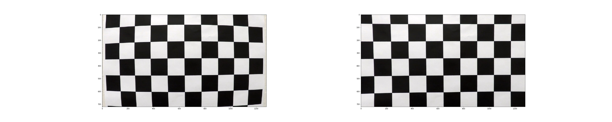
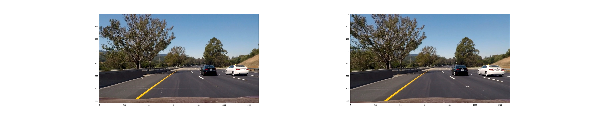
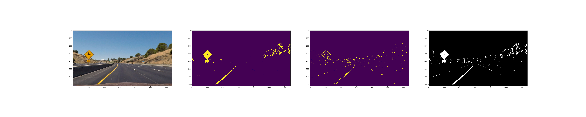
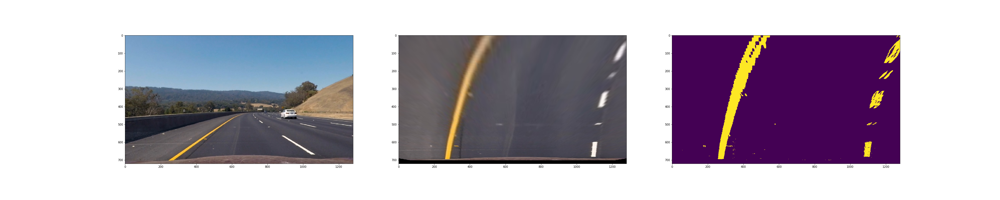
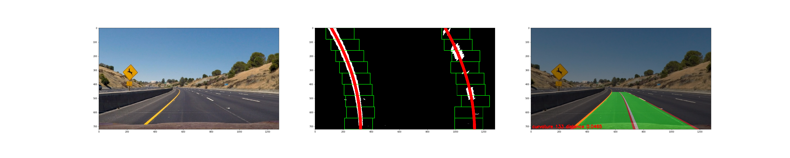
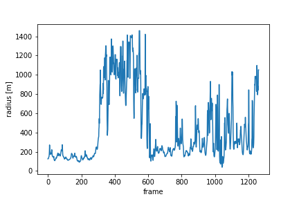
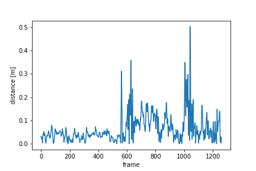
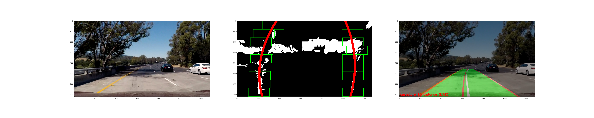
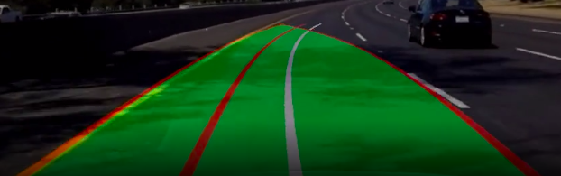

# Advanced Lane Finding
In this notebook I will run the experiments included
in the report.

## Pipeline

First I project the image using a calibrated camera. I then find
the binary image highlighting lanes using sobel edge detection
and color thresholding in HLS space. The binary image of the lanes
is then projected to a birds eye view. I apply a sliding window
across the left and right lanes starting at the histogram peeks
in the bottom of the image. I then fit a second degree polynomial 
to the detected points. The detection is smoothed and corrected
accross frames.

## Implementation

I implement the processing pipeline in my library `lib_lanes` in the
folder with the same name:

+ `cameras.py`: Contains a class for a calibrated camera.
+ `perspective.py`: A perspective transform to compute the birdseye view.
+ `thresholding.py`: Compute binary images based on color thresholding and sobel edge detection.
+ `lane_detector.py`: Detect lanes using a sliding window and polynomial line fitting.
+ `smooth.py`: Smooth lane detection in videos and reject results based on curvature.
+ `pipeline.py`: Run the pipeline on a video.

In the following I will provide examples of the pipeline components and compute the final video

## 1. Camera Calibration

The calibration works by detecting corners in the source images first and mapping
them onto a square grid. We then use the calibration funciton to calculate the
camera matrix and calculate the distortion. Using both we can undistort images

As one can see in the test images, we successfull removed the distortion from the checker board.
The original image is shown on the left and the undistorted image on the right.

We now can apply the code to one of our test images. Again, the original image is shown on the left and the undistorted image on the right.

## 2.Thresholding

We binarize images by applying a threshold to the x component of the image
and the saturatoin component of the hls color space. We combine the binary
images by adding the results together.

The lines show up nicely in the combined image. From left to right we see
the undistorted image, the saturation thresholded image, the sobel thresholded
images and the combined image.

## 3. Projective Transform

In order to find the lanes, we transform the image into a birdseye view. We get points on the undistorted
image forming a trapezoid on top of the lanes. We then find a transform that maps the lanes ontop a square
resulting in the birds eye view. In the end we are projecting the binary image.
As one can see we successfully map the images to the birdseye view.

## 4 Lane detectors

we first start by using the histogram method to find the two lanes at the bottom of the page. We then shift a sliding window along each line. The next center of the window is the mean of the x positions in the last window.
We then fit a polynomial to the left and right lane.

We can see the windows along the left and right lane highlighted in green. We then use the polynomial
fit to generate the x positions for all y positions in the image. The results are marked up in red (center image).
Ones the lines are found we can make a mask in the birds eye view space and project it back onto the real image
(right image). We can calculate the curvature by using the computed x and y positions scaled to meters (estimating the distances of the trapezoid from the image). For the center lane, we compute the center lane as the mid points of the left and right lane and the center points of the trapezoid. We then calculate the root mean square error.
The center lane of the trapezoid is shown in "white" and the center lane is marked in red. 

## 5. Video

We can now compute the output video. We average the result of the last 6 lane
detections and reject lane detections with an unrealistic curavture .

The output file is: `output.mp4` and the curvature and distance values for each frame
can be found in `log.csv`.

I also plot distance and radius of the track:

## 6. Issues
There are sometimes problems with shadows in the thresholded image resulting
in bad lane detections.

I also have a lane error based on shadows at around sec 41 in the video.

In this case we could reject frames where the left and right curvature is off by too much.

