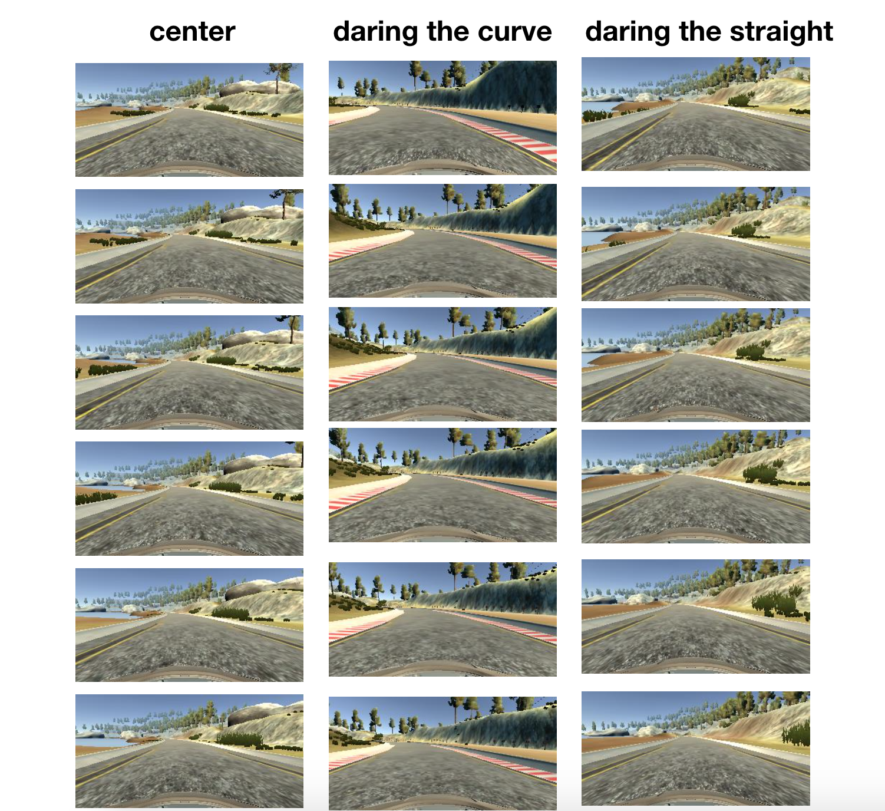

# **Behavioral Cloning** 
---

**Behavioral Cloning Project**

The goals / steps of this project are the following:
* Use the simulator to collect data of good driving behavior
* Build, a convolution neural network in Keras that predicts steering angles from images
* Train and validate the model with a training and validation set
* Test that the model successfully drives around track one without leaving the road
* Summarize the results with a written report

---
### Files Submitted 

My project includes the following files:
* model.py containing the script to create and train the model.
* drive.py for driving the car in autonomous mode
* model.h5 containing a trained convolution neural network 
* Readme.md or writeup_report.pdf summarizing the results

### Model Architecture and Training Strategy

#### 1. Solution Design Approach

I chose to try three models. One large inception
model, one transfer learning model based on VGG16
and the nvidia inspired model from the lecture.

All models start with cropping the image to the road part and normalizing the image. I also add 
Dropout layers in each model.

##### Inception model (model.py: l147-203)
I designed a large neural network using 
`three` inception layers each with:

+ 16 1x1 convolutions
+ 16 3x3 convolutions
+ 16 5x5 convolutions
+ Then all of the conv layers are concatenated 
+ 2x2 Max pooling is applied 

followed by 4 dense layers. Furthermore,
I added a residual connection from layer
1 to layer 3. This model did not
work well. I think I do not have enough data
to fit a model of that size.

##### Transfer learning (model.py: l90-116)
Basically the convolutions are taken from VGG16
and I add 4 dense layers. This model did not
work either. I think I do not have enough data
to train it either. I also tried freezing the
model partly and fully but the training data
from VGG16 is probably different to our task.

##### Nvidia Model (model.py: l119-144)
Using the architecture from nvidia self driving
presented in the lecture:

+ 32 5x5 stride 2x2 convolutions
+ 32 5x5 stride 2x2 convolutions
+ 64 5x5 stride 2x2 convolutions
+ 64 3x3 convolutions
+ 64 3x3 convolutions

then four dense layers. This model worked best.

#### Creation of the Training Set & Training Process

I basically drove around the track three times first
and then recorded a second batch with two laps when
I noticed I needed more data.

I mostly drove in the center but somtimes on purpose
cut a curve closer and sometimes drove closer
to the border on a straight stretch to vary
situations. 

I also used the left and right images of the camera
and flipped the images, too. In order
to easily model all the data augmentation I implemented
a class `DrivingInstance` in (model.py: l32-87)
that performs the image flip and adjusts the steering
angle for the augmented instances. I also can
generate a stream of these instances from several
`driving_logs`. The driving logs are parsed using
pandas. The generator shuffles the driving instances
and generated batches of the images and the
augmented data.

The resulting dataset has `14295` instances. I chose a batch size of `32` driving instances. With the augmentations each batch is `4` times as large. The data
is split using a `80/20` split. I am using the adam
optimizer and train for three epochs.