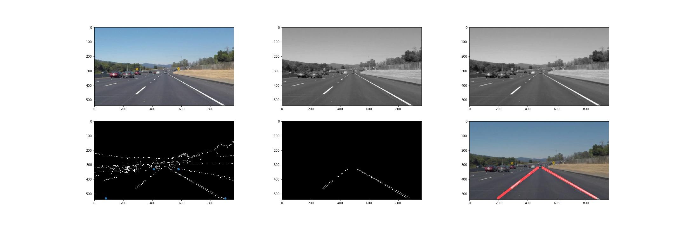
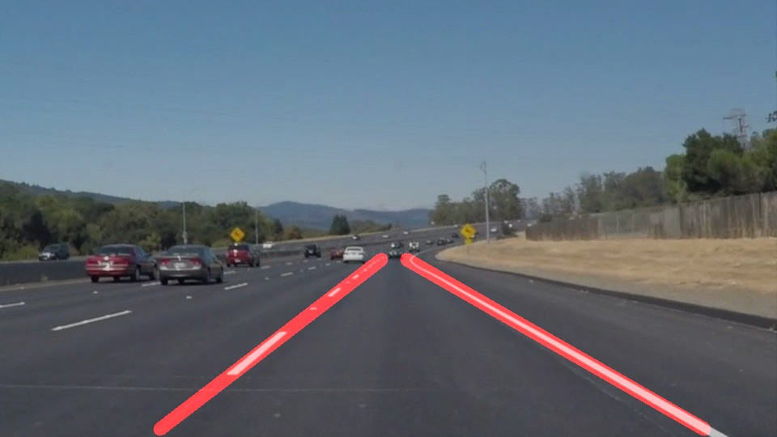
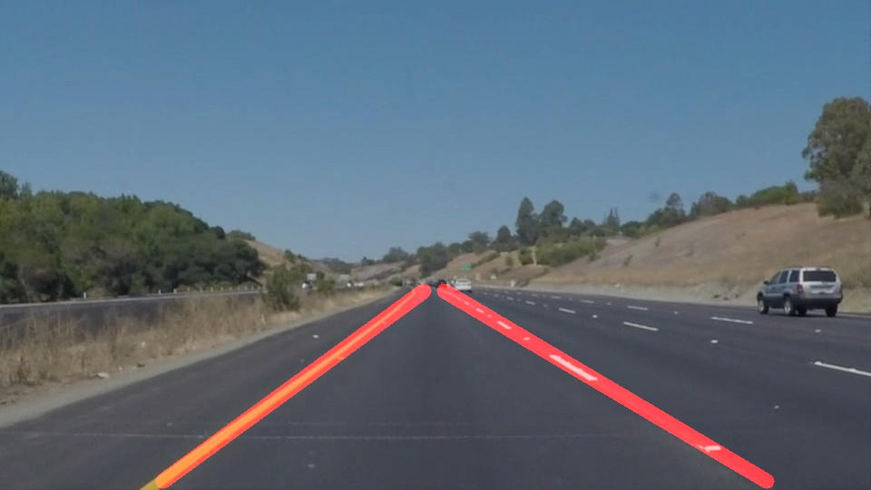

# **Finding Lane Lines on the Road** 

---

**Finding Lane Lines on the Road**

The goals / steps of this project are the following:
* Make a pipeline that finds lane lines on the road
* Reflect on your work in a written report

---

### Reflection

### 1. Lane Detection Pipeline

My basic pipeline is shown in the Figure below.
In the top row we see the original image,
the gray scale conversion and finally the 
blurred image. We use gaussian blur with 
a `5x5` kernel.

The first image in the
second row shows the results of the edge
detection as well as the corner points of
the area of interest. The thresholds are
`50` and `150`. As an area of interest
we use the floowing trapezoid:
+ (80, 530)
+ (410, 330)
+ (580, 330) 
+ (900, 530)

The area of interest I extracted is also 
shown in the center bottom image. We then
apply the hough tranform with the following
parameters:
+ Resolution in pixels `rho`: 2
+ Angular resulution `theta`: 1 radian or `pi / 180`
+ Minimum number of intersections to detect line: 40
+ Minimum line length: 30
+ Maximum gap: 15

We process the detected lines in the draw
lines function.
For each line segment detected by the hough transform we calculate the slope as: 
 
+ `(y2 - y1) / (x2 - x1)`

If the slope is negative we assign the points
to the `left lane` and to the `right lane`
otherwise. We save the `x1`s of the left
and right lane and the `y1`s of the left
and right lane. Furthermore, we save the slope `s`. Now we can get the center `x` and center
`y` for each lane and the average slope:

+ `x = sum(x1 .. xn) / n`
+ `y = sum(y1 .. yn) / n`
+ `s = sum(s1 .. sn) / n`

I also aim to smooth the slope using the previous slope in videos:

+ `momentum = 0.9`
+ `s(i) = (1.0 - momentum) * s(i) + momentum * s(i-1)`
Which should reduce flickering.

The general line formular is:

+ `y = x * s + b`

First we can calculate the bias as:

+ `b = y - x * s`

If we want to draw the line we need to
know where the line will intersect
the `min_y` and `max_y` of the area of interest. If we solve for the required
x values:

+ `x_start = (min_y - b) / s`
+ `x_end   = (max_y - b) / s`

We can then plot the lane as the line:

+ `(x_start, min_y)`
+ `(x_end, max_y)`

Some results are shown below:

I implemented the actual pipeline as a python class for two reasons.
First I keep all the intermediate results in each frame / image for potential
plotting and debugging purposes. I also keep track of the previous slope
when the pipeline is applied in a video. In order to reduce code
duplication I also introduced an AverageLine class so that the
left lane and right lane can be computed using the same code.

### 2. Identify potential shortcomings with your current pipeline

In my oppinion the pipeline has two main shortcomings (yellow vide)
+ i.  Sometimes there is are no lines found 
+ ii. Sometimes the line jumps 

The first error happens with parameters that are too conservative. The
second parameters happen with parameters that are too loose.
In the first case we did not detect any lines for the left or right lane.
Obviously we can not draw the lanes in that case.

The second error happens when we detect too many lines. Especially
at the top of the area of interest. Then the lanes get pulled
over into the other lane.

### 3. Suggest possible improvements to your pipeline

My main ideas is automated parameter estimation.
In the following I will sketch my idea.
First I would create a dataset of color pixel that describe
`lane` and `not lane`. Then I would build probability distributions
of both: 
+ `P(rgb|lane)`
+ `P(rgp|not lane)`.

Given a parameterization `theta` and an image dataset `x` I could compute the lanes as described
in the pipeline section for each image: `lanes(x1, theta) .. lanes(xn, theta)`. For each pixel
on a line `rgb1 ... rgbm` i would compute the log likelihood ratio: `score_i = log(P(rgb_i|lane))/log(P(rgb|not lane))`. And I could score a paramter set as: 

+ `score = sum([sum(score_i in image1) ... sum(score_i in imagen)])`

Basically the log likelihood ratio is higher if the probability of the color under 
the lane is higher for the `lane` class. So the total score is better the higher it is.
Naively we could span a grid in the parameter space and then search the highest score.
However, depending on the dataset size and the resolution of our parameters that could
take very long. An approximation is to learn another model (in literature often a random forest or gaussian process) that takes as input the parameters `theta` and aims to predict the `score`
without running the pipeline. The model has to be cheaper to evaluate than scoring the dataset.
We can generate the training data by sampling solutions.