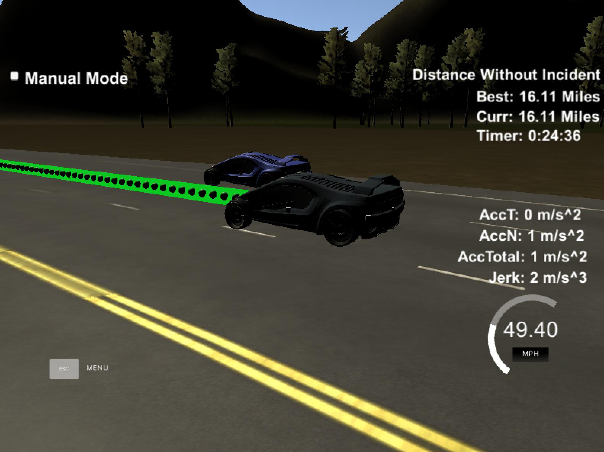

# Reflection on how to generate paths.

There are two steps in generating my paths. 
Behavior planning based on the sensor fusion
and generating the actual x/y coordinates.
Both parts closely follow the Q&A video. 
On top of that I added lane changeing behavior.

## 1. Behavior Planning.

The sensor fusion code `main.cpp lines 104-124` gives me lane occupation information in
terms of three booleans representing the following statements:

+ Is my lane occupied in front of me 
+ Is the lane left of me occupied or is this the `leftmost` lane
+ Is the lane right of me occupied or is this the `rightmost` lane

Based on this my car implements the following behavior `main.cpp lines 126 - 144`:
+ Lane changes are only allowed above a certain speed and only every 100th update cycle. Slowly changeing lanes could be dangerous because other cars could crash into us and often lane changes could lead to eradic behavior. It is also considered rude to jump lanes to often ... in my oppinion.
+ We aim to drive on the right most lane (considered polite in Germany ... I dont know about other places ... definately wrong in the UK). That means if the right side is free we switch lanes to the right.
+ If something is in front of us and nothing on the left we start to switch lanes left.
+ Otherwise we slow down.
+ If we are too slow, we speed up.

## 2. Path planning

The behavior planning basically changes the lane variable and the reference velocity. 
For conveniance I use the spline library to produce the segments.

The path planner works as follows:
We fit a spline to the two most recent points from the previous trajectory and three distant points (`main.cpp lines 154 - 182`). We then transform all those points to the local coordinate system of our car (`main.cpp lines 184 - 189`). We use the previous points together with equally spaced points from the spline 
to form the final trajectory and all points are converted back to the global coordinate system (`main.cpp 196-219`).

