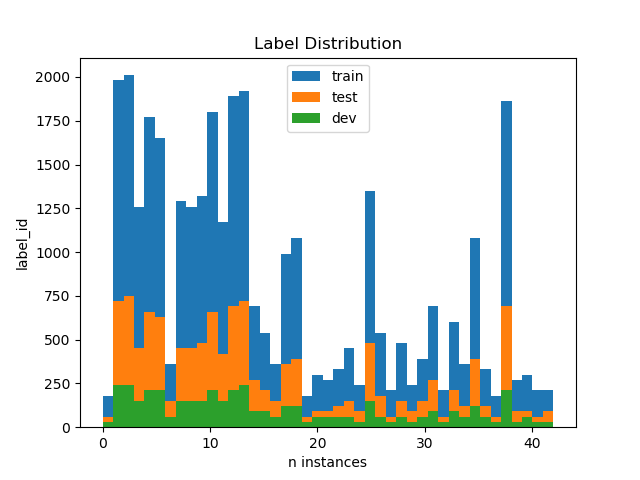

# **Traffic Sign Recognition** 


**Build a Traffic Sign Recognition Project**

The goals / steps of this project are the following:
* Load the data set (see below for links to the project data set)
* Explore, summarize and visualize the data set
* Design, train and test a model architecture
* Use the model to make predictions on new images
* Analyze the softmax probabilities of the new images
* Summarize the results with a written report

---
### Implementation

#### Tensorflow v1
Since the lectures are introducing the tensorflow v1 API
I am using it, too. However, on my machine I am running tensorflow
v2. In order to stay compatible I use `tf.compat.v1` for all things related to graphs and sessions. Furthermore, the `flatten` operation
moved from contrib to the main package.

#### Implementation
I put my implementation in the `lib_signs` folder:
+ `models.py`: includes the three models I tried
+ `preprocess.py`: includes my preprocessing steps

### Data Set Summary & Exploration

#### 1. Provide a basic summary of the data set. In the code, the analysis should be done using python, numpy and/or pandas methods rather than hardcoding results manually.

Number of training examples = 34799
Number of testing examples = 12630
Number of validation examples = 4410
Image data shape = (32, 32, 3)
Number of classes = 43
I calculated the summary about the dataset directly
from the pickled numpy arrays:

* The size of training set is ? `34799` instances
* The size of the validation set is ? `4410` instances
* The size of test set is ? `12630` instances
* The shape of a traffic sign image is ? `(32, 32, 3)`
* The number of unique classes/labels in the data set is ? `43`

#### 2. Include an exploratory visualization of the dataset.

I plotted the labels contained in the separate splits
as a histogram.

As one can see the label distribution is quite
imbalanced. The splits show the same distribution.
If I would collect more data I would collect
examples of under represented classes.

Below are some examples of traffic signs:


### Design and Test a Model Architecture

#### 1. Describe how you preprocessed the image data. What techniques were chosen and why did you choose these techniques? Consider including images showing the output of each preprocessing technique. Pre-processing refers to techniques such as converting to grayscale, normalization, etc. 

I converted the images to gray scale by adding
there rgb components with equal weights:
`gray = r/3 + g/3 + b/3`.

I then z-normalize each image. Instead
of using the `128` as suggested I calculate
the actual mean and variance in each image.
Below I show some examples of gray scale and
normalized results.


#### 2. Describe what your final model architecture looks like including model type, layers, layer sizes, connectivity, etc.) Consider including a diagram and/or table describing the final model.

I tried three model architectures. First I designed
a very simple baseline model. I decided to start with
a simple feed forward neural network (4 layers)
with dropout.


I then used the code from the LeNet quiz


My final model is a larger version of the LeNet quiz
model.


My changes include one more convolutional layer (3x3).
I also increased the number of filters per layer a lot.
I also added another dense layer and added a dropout layer.

#### 3. Describe how you trained your model. The discussion can include the type of optimizer, the batch size, number of epochs and any hyperparameters such as learning rate.

During the training I used the `ADAM optimizer` with
an initial learning rate of `0.001`.
I trained each model for `10` epochs and a 
batch size of `128`. 

#### 4. Describe the approach taken for finding a solution and getting the validation set accuracy to be at least 0.93. Include in the discussion the results on the training, validation and test sets and where in the code these were calculated. Your approach may have been an iterative process, in which case, outline the steps you took to get to the final solution and why you chose those steps. Perhaps your solution involved an already well known implementation or architecture. In this case, discuss why you think the architecture is suitable for the current problem.

My final model results were:
* training set accuracy of ? `0.998`
* validation set accuracy of ? `0.957`
* test set accuracy of ? `0.929`

As described above I started with the simple
dense feed forward baseline
model. I knew it would be inefficient but I
wanted to see a baseline to see how far I am
from the required solution. I got these
results:

* training set accuracy of ? `0.962`
* validation set accuracy of ? `0.826`
* test set accuracy of ? `0.810`

I then used the lenet code from the quiz:

* training set accuracy of ? `0.992`
* validation set accuracy of ? `0.915`
* test set accuracy of ? `0.894`

From there I started to increase the model size.

### Test a Model on New Images

#### 1. Choose five German traffic signs found on the web and provide them in the report. For each image, discuss what quality or qualities might be difficult to classify.

Here are seven German traffic signs that I found on the web:


The second to last might be harder since it has
some graffiti on it. The figure below shows the
same signs preprocessed.


#### 2. Discuss the model's predictions on these new traffic signs and compare the results to predicting on the test set. At a minimum, discuss what the predictions were, the accuracy on these new predictions, and compare the accuracy to the accuracy on the test set (OPTIONAL: Discuss the results in more detail as described in the "Stand Out Suggestions" part of the rubric).

Here are the results of the prediction:

| Image			        |     Prediction	        					| 
|:---------------------:|:---------------------------------------------:| 
| Priority road			| Priority road      							|
| 30 km/h      		| Speed limit (30km/h)    									| 
| Stop Sign     			| 	Stop	|
| 120 km/h	      		| Speed limit (120km/h)					 				|
| 3.5 tons					| Vehicles over 3.5 metric tons prohibited											|
| Priority road			| Priority road      							|
| General caution			| General caution      							|


The model was able to correctly guess 4 of the 5 traffic signs, which gives an accuracy of 80%. This compares favorably to the accuracy on the test set of ...

#### 3. Describe how certain the model is when predicting on each of the five new images by looking at the softmax probabilities for each prediction. Provide the top 5 softmax probabilities for each image along with the sign type of each probability. (OPTIONAL: as described in the "Stand Out Suggestions" part of the rubric, visualizations can also be provided such as bar charts)

The model seems quite certain about all predictions:


```
[0.96016085, 0.01088633, 0.00392745],
[0.85811687, 0.11280448, 0.00657468],
[0.9432018 , 0.01253019, 0.01064685],
[0.45848128, 0.20271203, 0.13851921],
[0.78101224, 0.06716801, 0.04947957],
[0.7645591 , 0.11729445, 0.01669577],
[0.91848487, 0.01678791, 0.00841755]
```

The highest uncertainty is in the speed limit sign with the
class indices: `[ 8,  0, 40]`. Which are:

* `Speed limit (20km/h)`
* `40,Roundabout mandatory`

In other words the `120` is most simliar to a sign reading `20`.
